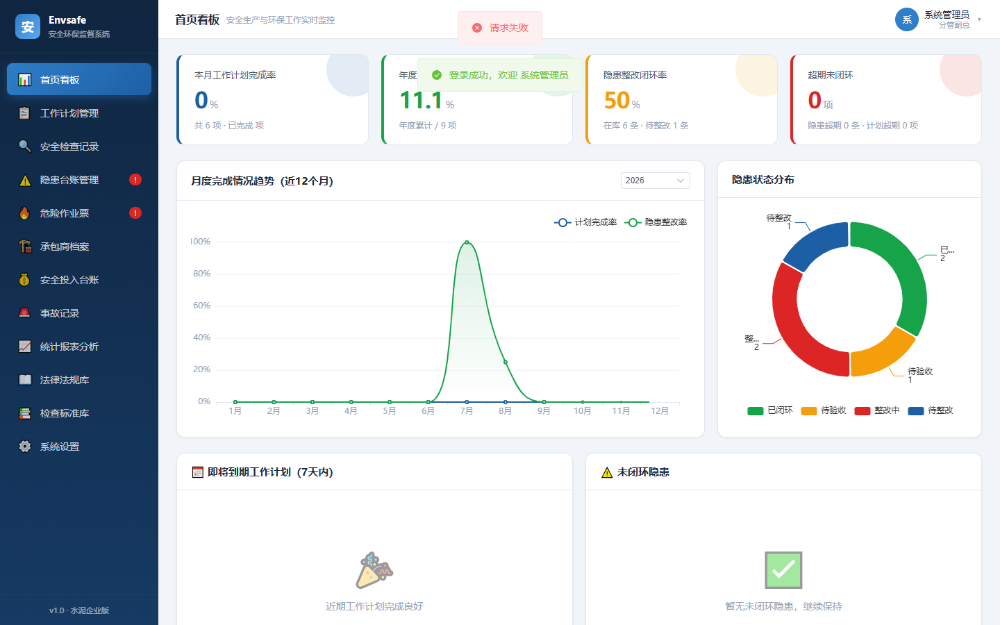
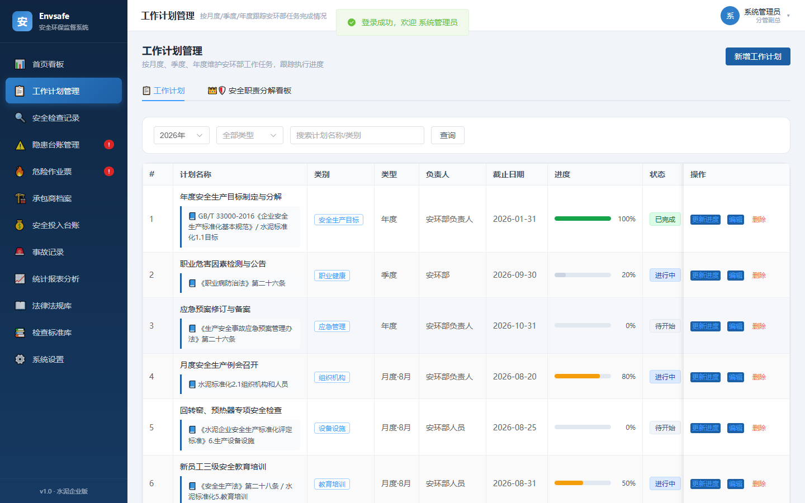
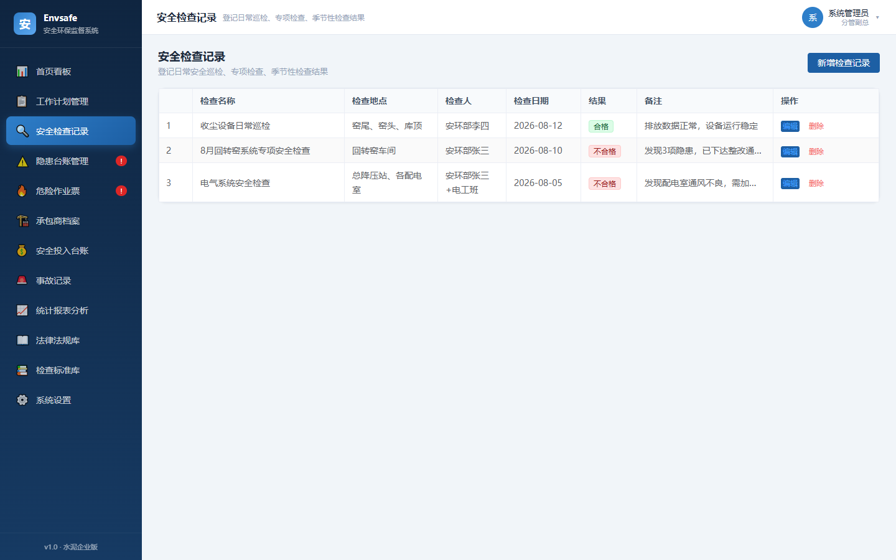
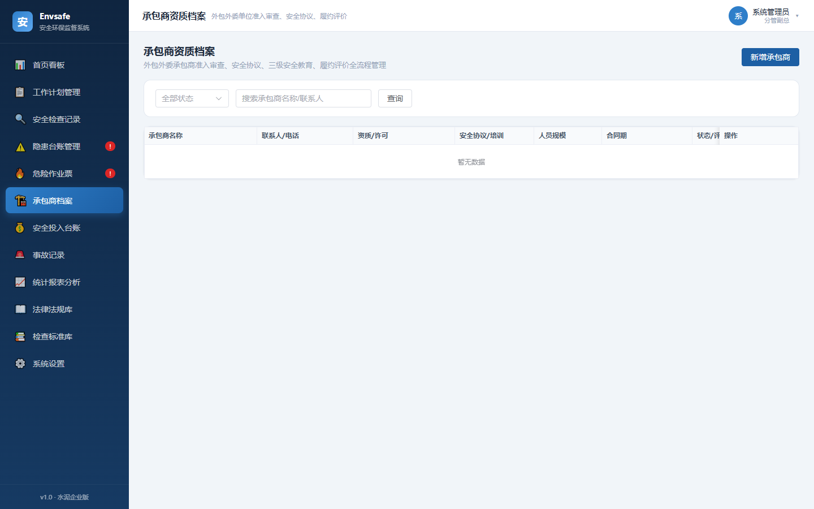
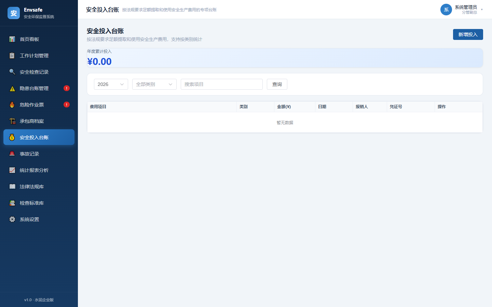
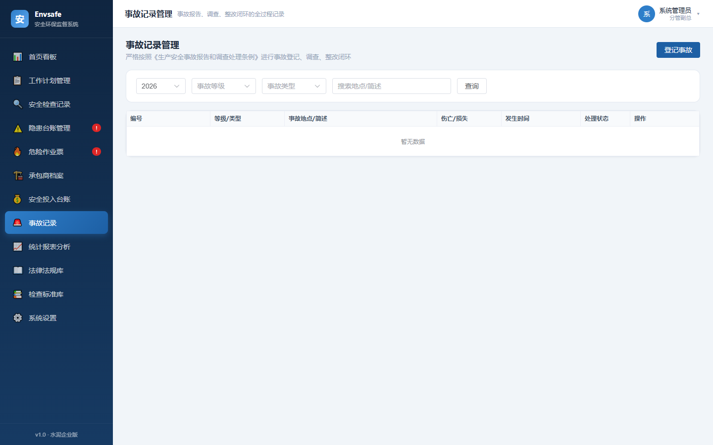
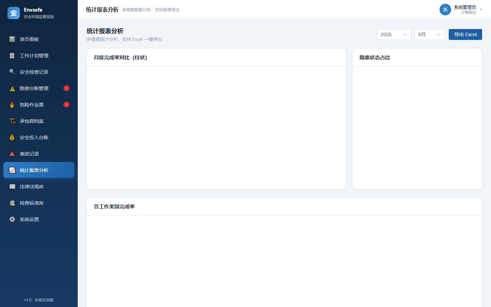
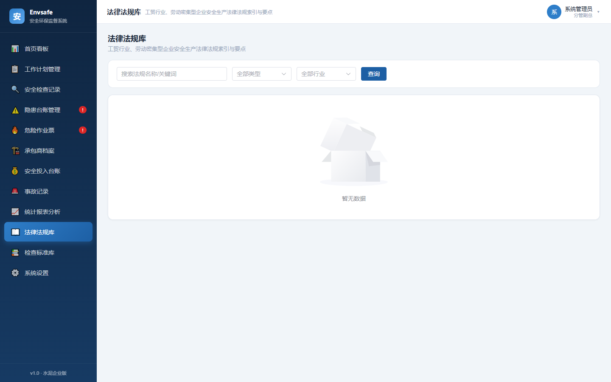
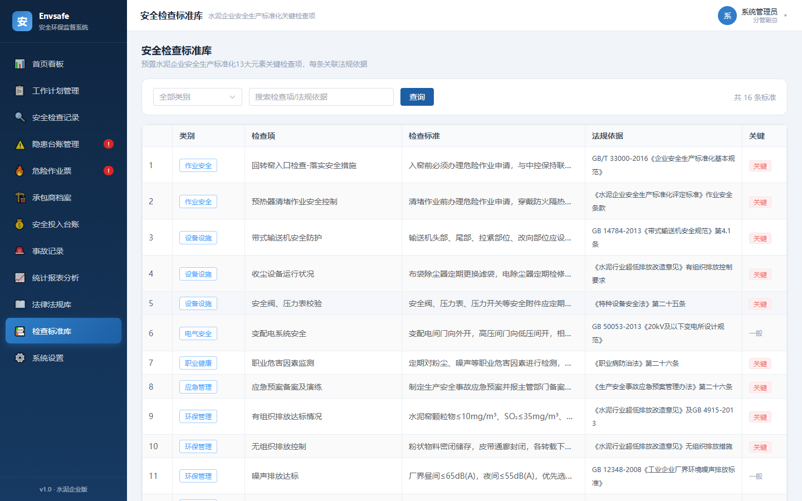
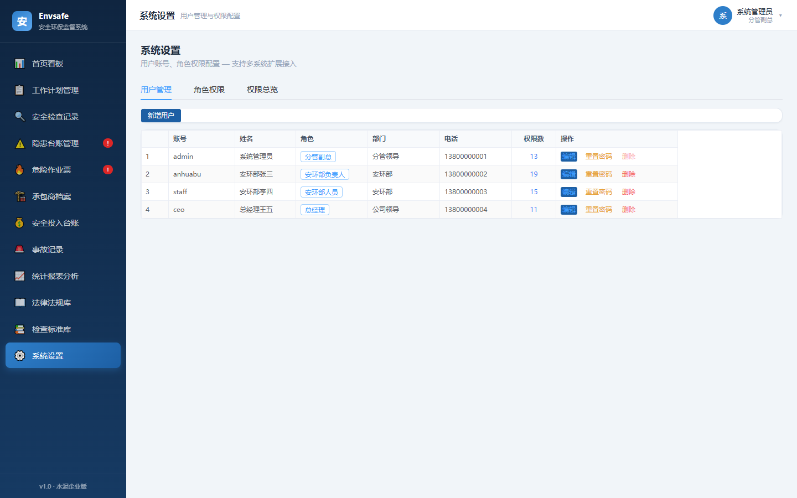

# 水泥企业安全环保工作监督系统（EnvSafe）

> 面向水泥企业安环部的安全生产与环保工作数字化管理平台，覆盖工作计划跟踪、隐患整改闭环、危险作业票管理、安全投入台账、事故记录、法律法规库等核心业务，结合最新工贸行业安全标准化要求与 RBAC 权限模型，支持多角色协同办公。

---

## 目录

- [系统简介](#系统简介)
- [功能模块](#功能模块)
- [系统截图](#系统截图)
- [技术架构](#技术架构)
- [项目结构](#项目结构)
- [部署要求](#部署要求)
  - [硬件要求](#硬件要求)
  - [系统环境要求](#系统环境要求)
  - [软件依赖要求](#软件依赖要求)
- [部署办法](#部署办法)
  - [快速部署（5 分钟启动）](#快速部署5-分钟启动)
  - [生产环境部署](#生产环境部署)
  - [Docker 部署（可选）](#docker-部署可选)
- [系统配置](#系统配置)
- [默认账号](#默认账号)
- [RBAC 权限模型](#rbac-权限模型)
- [API 接口概览](#api-接口概览)
- [常见问题](#常见问题)
- [许可证](#许可证)

---

## 系统简介

本系统专为水泥企业安全环保部门设计，旨在实现以下核心目标：

1. **工作监督** — 按月度/季度/年度跟踪安环部工作计划完成情况
2. **隐患闭环** — 隐患登记 → 整改 → 验收的全流程闭环管理
3. **合规管理** — 内置工贸行业、劳动密集型企业安全生产法律法规库
4. **职责落地** — 企业主要负责人、分管负责人、安全管理员三级安全职责分解到计划管理
5. **权限管控** — RBAC 角色权限模型，按角色动态分配菜单与操作权限

## 功能模块

| 序号 | 模块 | 说明 |
|:---:|------|------|
| 1 | 首页看板 | 安全生产与环保工作实时数据概览 |
| 2 | 工作计划管理 | 按月度/季度/年度跟踪安环部任务完成情况，含三级负责人职责分解看板 |
| 3 | 安全检查记录 | 登记日常巡检、专项检查、季节性检查结果 |
| 4 | 隐患台账管理 | 隐患登记 → 整改 → 验收的闭环管理 |
| 5 | 危险作业票管理 | 动火/有限空间/高处等八大特殊作业全流程票证管理 |
| 6 | 承包商资质档案 | 外包外委单位准入审查、安全协议、履约评价 |
| 7 | 安全投入台账 | 按法规要求足额提取和使用安全生产费用的专项台账 |
| 8 | 事故记录管理 | 事故报告、调查、整改闭环的全过程记录 |
| 9 | 统计报表分析 | 多维度数据分析，支持 Excel 报表导出 |
| 10 | 法律法规库 | 工贸行业、劳动密集型企业安全生产法律法规索引与要点 |
| 11 | 检查标准库 | 安全检查标准模板，支持标准化巡检 |
| 12 | 系统设置 | 用户管理、角色权限管理、权限总览（RBAC） |

---

## 系统截图

### 登录页面


### 首页看板


### 工作计划管理


### 安全检查记录


### 隐患台账管理


### 危险作业票管理


### 承包商资质档案


### 安全投入台账


### 事故记录管理


### 统计报表分析


### 法律法规库


### 检查标准库


### 系统设置


---

## 技术架构

```
┌─────────────────────────────────────────────────┐
│                   浏览器端                        │
│  Vue 3 + Element Plus + ECharts + Vue Router    │
│  (单页应用 SPA，无需 Node 构建步骤)                │
└──────────────────────┬──────────────────────────┘
                       │ HTTP / RESTful API
┌──────────────────────┴──────────────────────────┐
│                 Flask 后端                        │
│  Blueprint 路由 │ SQLAlchemy ORM │ Session 认证   │
│  Flask 3.0 + Werkzeug + openpyxl + Pillow        │
└──────────────────────┬──────────────────────────┘
                       │
┌──────────────────────┴──────────────────────────┐
│               SQLite 数据库                       │
│  User / Role / Permission / WorkPlan / Hazard   │
│  Inspection / WorkPermit / SafetyCost /         │
│  Accident / Contractor / LawReference / ...     │
└─────────────────────────────────────────────────┘
```

| 层级 | 技术选型 | 说明 |
|------|---------|------|
| 前端 | Vue 3.4 + Element Plus 2.4 | 单页应用，CDN 资源已本地化 |
| 图表 | ECharts 5.5 | 首页看板数据可视化 |
| 后端 | Flask 3.0 + SQLAlchemy 2.0 | Blueprint 模块化路由 |
| 数据库 | SQLite 3 | 轻量级文件数据库，零配置 |
| 认证 | Session + Werkzeug | Cookie-based 认证，密码 Hash 存储 |
| 权限 | RBAC 模型 | Role → Permission 多对多关联 |
| 报表 | openpyxl 3.1 | Excel 报表导出 |

---

## 项目结构

```
EnvSafe/
├── backend/                    # 后端（Flask）
│   ├── app.py                  # 应用入口 + 种子数据
│   ├── config.py               # 配置文件
│   ├── models.py               # 数据模型（User/Role/Permission/WorkPlan...）
│   ├── requirements.txt        # Python 依赖
│   ├── import_laws.py          # 法律法规导入脚本
│   ├── seeds_secondary.py      # 二级标准化种子数据
│   ├── envsafe.db              # SQLite 数据库（运行后自动生成）
│   ├── uploads/                # 上传文件目录（运行后自动生成）
│   └── routes/                 # API 路由模块
│       ├── __init__.py
│       ├── auth.py             # 认证（登录/登出/获取当前用户）
│       ├── work_plan.py        # 工作计划管理
│       ├── inspection.py        # 安全检查记录
│       ├── hazard.py           # 隐患台账管理
│       ├── report.py           # 统计报表分析
│       ├── system.py           # 系统设置（用户/角色/权限）
│       ├── secondary.py        # 作业票/承包商/安全投入/事故
│       └── utils.py            # 工具函数
│
├── frontend/                   # 前端（Vue 3 单页应用）
│   ├── index.html              # 主页面（含所有组件）
│   ├── package.json            # 前端依赖声明
│   └── libs/                   # 本地化前端库（无需 CDN）
│       ├── vue.js              # Vue 3
│       ├── element-plus.js     # Element Plus 组件库
│       ├── element-plus.css    # Element Plus 样式
│       ├── ep-icons.js         # Element Plus 图标
│       ├── echarts.js          # ECharts 图表
│       └── element-plus-zh.js  # Element Plus 中文语言包
│
├── docs/
│   └── screenshots/            # 系统截图
│
├── .gitignore
└── README.md
```

---

## 部署要求

### 硬件要求

| 资源 | 最低配置 | 推荐配置 |
|------|---------|---------|
| CPU | 2 核 | 4 核 |
| 内存 | 2 GB | 4 GB |
| 硬盘 | 5 GB（含数据库+上传文件） | 20 GB |
| 网络 | 局域网即可 | 千兆局域网 |

> 本系统为轻量级应用，SQLite 文件数据库无需独立数据库服务器，普通办公电脑即可部署。

### 系统环境要求

| 项目 | 要求 |
|------|------|
| 操作系统 | Windows 10/11、Windows Server 2016+、Ubuntu 20.04+、CentOS 8+ |
| Python | **3.8+**（推荐 3.10+） |
| 浏览器 | Chrome 90+、Edge 90+、Firefox 90+（需支持 ES2015+） |
| 端口 | 默认 5000（可修改） |

### 软件依赖要求

**后端 Python 依赖**（见 [backend/requirements.txt](backend/requirements.txt)）：

| 依赖 | 版本 | 用途 |
|------|------|------|
| Flask | 3.0.0 | Web 框架 |
| Flask-CORS | 4.0.0 | 跨域支持 |
| Flask-JWT-Extended | 4.6.0 | JWT 令牌支持 |
| SQLAlchemy | 2.0.23 | ORM 数据库操作 |
| Werkzeug | 3.0.1 | WSGI 工具 + 密码 Hash |
| openpyxl | 3.1.2 | Excel 报表导出 |
| Pillow | 10.1.0 | 图片上传处理 |

**前端依赖**（已全部本地化，无需 npm install）：

| 依赖 | 版本 | 用途 |
|------|------|------|
| Vue | 3.4.21 | 前端框架 |
| Element Plus | 2.4.4 | UI 组件库 |
| ECharts | 5.5.0 | 数据可视化图表 |
| @element-plus/icons-vue | 2.3.1 | 图标库 |

---

## 部署办法

### 快速部署（5 分钟启动）

```bash
# 1. 克隆仓库
git clone https://github.com/bcyear88-ai/envsafe.git
cd envsafe

# 2. 创建 Python 虚拟环境
python -m venv venv

# Windows
venv\Scripts\activate
# Linux/macOS
# source venv/bin/activate

# 3. 安装后端依赖
cd backend
pip install -r requirements.txt

# 4. 初始化数据库（自动建表 + 种子数据）
python -c "from app import init_db; init_db()"

# 5. 启动服务
python app.py
```

启动后看到以下输出即为成功：

```
============================================================
  水泥企业安全环保工作监督系统 启动中...
  访问地址: http://localhost:5000
  默认账号: admin / 123456  (分管副总)
            anhuabu / 123456  (安环部负责人)
============================================================
 * Running on http://127.0.0.1:5000/
```

浏览器打开 **http://localhost:5000** 即可访问。

### 生产环境部署

生产环境建议使用 **Gunicorn**（Linux）或 **Waitress**（Windows）替代 Flask 开发服务器：

**Linux（Gunicorn）：**

```bash
pip install gunicorn
cd backend
gunicorn -w 4 -b 0.0.0.0:5000 app:create_app()
```

**Windows（Waitress）：**

```bash
pip install waitress
cd backend
waitress-serve --host=0.0.0.0 --port=5000 app:create_app
```

**Nginx 反向代理（推荐）：**

```nginx
server {
    listen 80;
    server_name your-domain.com;

    location / {
        proxy_pass http://127.0.0.1:5000;
        proxy_set_header Host $host;
        proxy_set_header X-Real-IP $remote_addr;
    }

    # 上传文件大小限制
    client_max_body_size 16m;
}
```

### Docker 部署（可选）

```dockerfile
FROM python:3.11-slim
WORKDIR /app
COPY backend/ /app/
RUN pip install --no-cache-dir -r requirements.txt waitress
EXPOSE 5000
CMD ["waitress-serve", "--host=0.0.0.0", "--port=5000", "app:create_app"]
```

```bash
docker build -t envsafe .
docker run -d -p 5000:5000 -v $(pwd)/backend/envsafe.db:/app/envsafe.db envsafe
```

---

## 系统配置

核心配置文件为 [backend/config.py](backend/config.py)，可修改以下参数：

| 参数 | 默认值 | 说明 |
|------|--------|------|
| `SECRET_KEY` | `envsafe-secret-key-2025-cement` | Session 密钥（**生产环境务必修改**） |
| `SQLALCHEMY_DATABASE_URI` | `sqlite:///envsafe.db` | 数据库路径 |
| `JWT_ACCESS_TOKEN_EXPIRES` | `86400`（秒） | Token 过期时间，默认 24 小时 |
| `UPLOAD_FOLDER` | `backend/uploads/` | 文件上传目录 |
| `MAX_CONTENT_LENGTH` | `16 MB` | 单次上传文件大小上限 |
| `ALLOWED_EXTENSIONS` | `png/jpg/jpeg/gif/bmp` | 允许的图片格式 |

**监听端口修改**（在 [backend/app.py](backend/app.py) 末尾）：

```python
if __name__ == '__main__':
    app = init_db() if not os.path.exists('envsafe.db') else create_app()
    app.run(host='0.0.0.0', port=5000, debug=False)
```

将 `port=5000` 改为你需要的端口即可。

---

## 默认账号

系统首次初始化后会自动创建以下测试账号：

| 账号 | 密码 | 角色 | 可见菜单数 | 说明 |
|------|------|------|:----------:|------|
| `admin` | `123456` | 分管副总 | 12 | 全部权限 |
| `anhuabu` | `123456` | 安环部负责人 | 12 | 含系统用户管理 |
| `staff` | `123456` | 安环部人员 | 10 | 无系统设置/无统计报表 |
| `ceo` | `123456` | 总经理 | 11 | 无系统设置 |

> **安全提示**：生产环境部署后，请立即在「系统设置 → 用户管理」中修改默认密码。

---

## RBAC 权限模型

系统采用标准 RBAC（Role-Based Access Control）模型：

```
User ──(N:1)──▶ Role ──(M:N)──▶ Permission
```

**权限码命名规范**：`{模块}.{动作}`

| 权限码 | 说明 |
|--------|------|
| `dashboard.view` | 首页看板 |
| `workplan.view` / `workplan.edit` | 工作计划 查看/编辑 |
| `inspection.view` / `inspection.edit` | 安全检查 查看/编辑 |
| `hazard.view` / `hazard.edit` | 隐患台账 查看/编辑 |
| `permit.view` / `permit.edit` | 危险作业票 查看/编辑 |
| `contractor.view` / `contractor.edit` | 承包商档案 查看/编辑 |
| `cost.view` / `cost.edit` | 安全投入 查看/编辑 |
| `accident.view` / `accident.edit` | 事故记录 查看/编辑 |
| `report.view` | 统计报表 |
| `law.view` | 法律法规库 |
| `standard.view` | 检查标准库 |
| `system.user` | 用户管理 |
| `system.role` | 角色权限管理 |

**新增模块只需 3 步**：
1. 后端种子数据增加 Permission 记录
2. 系统设置 → 角色权限 → 勾选分配
3. 前端 `menuPermMap` 增加菜单与权限码映射

---

## API 接口概览

| 模块 | 路由前缀 | 主要接口 |
|------|---------|---------|
| 认证 | `/api/auth` | `POST /login`、`GET /me`、`POST /logout` |
| 工作计划 | `/api/workplan` | CRUD + 统计 |
| 安全检查 | `/api/inspection` | CRUD + 模板管理 |
| 隐患管理 | `/api/hazard` | CRUD + 整改闭环 |
| 统计报表 | `/api/report` | 多维统计 + Excel 导出 |
| 系统管理 | `/api/system` | 用户/角色/权限 CRUD |
| 作业票/承包商/投入/事故 | `/api/secondary` | 四模块 CRUD |

> 所有接口均需登录（Cookie Session 认证），部分写操作需要对应模块的 `.edit` 权限。

---

## 常见问题

**Q: 启动后访问页面空白？**
A: 强制刷新浏览器缓存（Ctrl+Shift+R），或清除浏览器缓存后重新访问。

**Q: 数据库在哪？如何备份？**
A: 数据库文件为 `backend/envsafe.db`，备份只需复制此文件。如需迁移到 MySQL/PostgreSQL，修改 `config.py` 中的 `SQLALCHEMY_DATABASE_URI` 即可。

**Q: 如何修改监听端口？**
A: 编辑 [backend/app.py](backend/app.py) 末尾的 `port=5000` 改为所需端口。

**Q: 前端需要 npm install 吗？**
A: 不需要。Vue、Element Plus、ECharts 等依赖已全部本地化到 `frontend/libs/` 目录，无需 Node.js 构建步骤。

**Q: 如何重置数据库？**
A: 删除 `backend/envsafe.db` 文件，重新运行 `python -c "from app import init_db; init_db()"` 即可重建。

**Q: 法律法规如何导入？**
A: 运行 `python backend/import_laws.py`，或通过系统界面手动录入。

---

## 许可证

本项目为内部使用，暂未开源许可证。如需使用请联系作者。

---

<p align="center">
  <sub>Built with Flask + Vue 3 + Element Plus + ECharts</sub>
</p>
